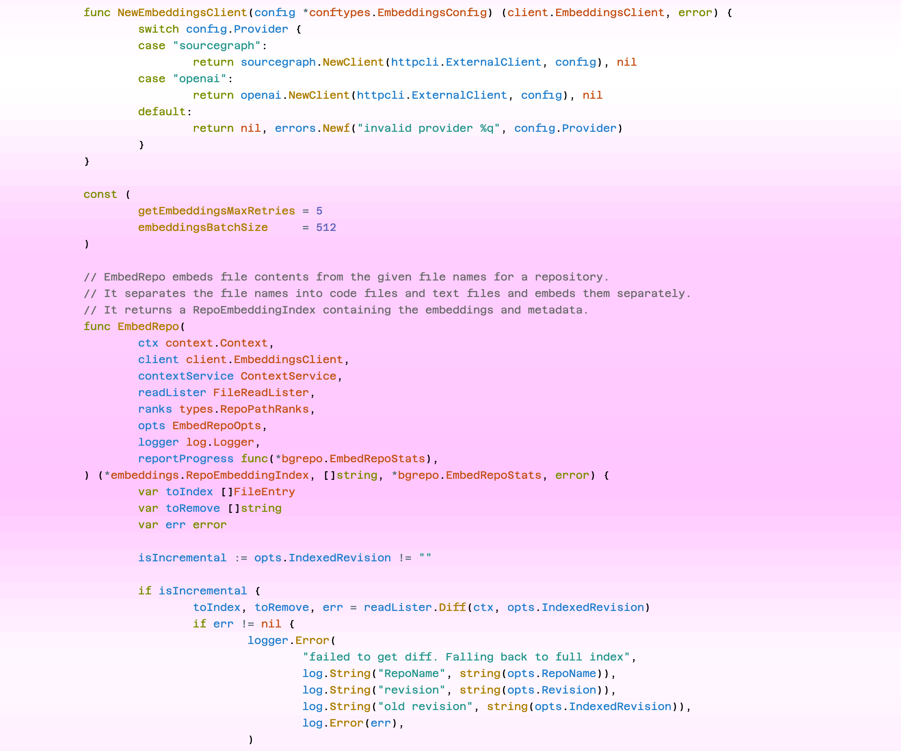

# Glance

Code at a glance. Highlight important parts of the code using embeddings and PageRank.

## Preview



## Usage

Install dependencies (Python 3.x):

```sh
pip install -r requirements.txt
```

Print out top 10 important "windows" of code:

```sh
# From a local file
python glance.py --model=intfloat/e5-small-v2 --file="file.go" --top=10

# From a Sourcegraph file
export SOURCEGRAPH_API_TOKEN=XYZ
python glance.py --model=intfloat/e5-small-v2 --file="https://sourcegraph.com/github.com/sourcegraph/sourcegraph/-/blob/internal/embeddings/embed/embed.go" --top=10
```

Run the web app:

```sh
export SOURCEGRAPH_API_TOKEN=XYZ
export GLANCE_MODEL_PATH=intfloat/e5-small-v2
flask --app app run --port 5001
```

And then navigate to: http://127.0.0.1:5001/?file=https://sourcegraph.com/github.com/sourcegraph/sourcegraph/-/blob/internal/embeddings/embed/embed.go

## How does it work?

1. We split the code into overlapping windows of a certain size (e.g., 5 lines).
1. For each window, we embed the code using a pre-trained code embedding model (e.g. `intfloat/e5-small-v2`). This gives us a dense vector representation of the code window.
1. We create an adjecency matrix by calculating the cosine similarity between all pairs of embeddings. The adjecency matrix represents a weighted undirected graph.
1. We run PageRank on the adjecency matrix to calculate the "importance" score of each code window.

Intuitively, code windows that are similar to many other important code windows will have a higher PageRank score and thus higher importance.

## Future Improvements

- Focusing on line windows is not ideal. Instead, a better approach would be to parse the code and identify syntactic structures like functions and classes.
- Cross-file and repository support. Embed an entire repo, and run PageRank across the repo embeddings. Would probably have to a more performant PageRank implementation.

## Thanks

Shout-out to Matt Neary's [Salience](https://github.com/mattneary/salience) project which inspired Glance.
